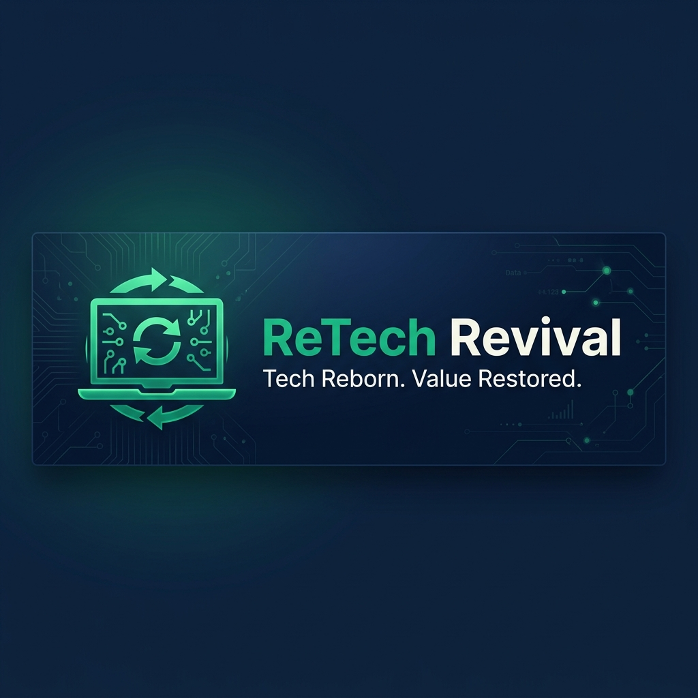

<p align="center">
  
</p>

<h1 align="center">ReTech Revival</h1>

<p align="center">
  <strong>Tech Reborn. Value Restored.</strong><br/>
  A premium full-stack marketplace for buying &amp; selling refurbished laptops.
</p>

<p align="center">
  <a href="#features"></a>
  <a href="#tech-stack"></a>
  <a href="#ml-engine"></a>
  <a href="LICENSE"></a>
</p>

<p align="center">
  <a href="#quick-start">Quick Start</a> •
  <a href="#features">Features</a> •
  <a href="#architecture">Architecture</a> •
  <a href="#api-reference">API Reference</a> •
  <a href="#contributing">Contributing</a>
</p>

---

## About

**ReTech Revival** is a production-ready, full-stack web marketplace built for the refurbished electronics economy. It bridges the gap between high-quality refurbished devices and students, startups, and professionals who need affordable tech — while promoting sustainability by reducing e-waste.

Every device listed on the platform passes a **50-point quality inspection** and ships with a **6-month warranty**, giving buyers confidence and sellers a fair, data-driven price for their old tech.

> *"Each refurbished laptop saves ~40kg of CO₂ compared to manufacturing a new one."*

---

## Features

### Buyer Experience
- **Smart Catalog** — Browse refurbished laptops with real-time filters (brand, condition, price range, processor)
- **Product Detail Pages** — Full specs, image gallery, and customer reviews with ratings
- **Shopping Cart** — Persistent cart with quantity management and price summaries
- **Secure Auth** — Bcrypt-hashed registration/login with session-based authentication

### Seller Experience
- **Instant Valuation Engine** — Multi-step sell form with dynamic, brand-specific processor selection
- **ML-Powered Price Prediction** — Get a fair, data-driven price estimate in under 2 minutes
- **Free Doorstep Pickup** — Schedule a pickup with professional device verification included

### Machine Learning Engine
Zero-dependency ML system built in pure JavaScript:

| Model | Algorithm | Purpose |
|-------|-----------|---------|
| **Price Predictor** | Multi-variable Linear Regression | Automated device valuation based on specs |
| **Recommender** | Cosine Similarity (Hybrid) | "Similar devices" and personalized suggestions |
| **Trending Scorer** | Exponential Decay | Real-time demand-based trending rankings |
| **User Segmentation** | K-Means++ Clustering | Behavioral user segmentation |

### UI/UX
- **Dark/Light Theme** — Automatic detection + manual toggle, persisted in localStorage
- **3D Animations** — Parallax tilt cards, scroll-reveal, magnetic buttons, particle effects, morphing blobs
- **AI Chatbot** — Integrated support chatbot with context-aware responses
- **Mobile Responsive** — Hamburger nav, stacked layouts, and touch-friendly UI across all breakpoints
- **Premium Design** — Navy & emerald color palette, glassmorphism, micro-animations, gradient borders

### Additional
- **Customer Reviews** — Star ratings, helpful votes, and dynamic review statistics
- **User Dashboard** — Order history and account management
- **Newsletter Subscription** — Email subscription system
- **SEO Optimized** — Proper meta tags, semantic HTML, heading hierarchy

---

## Architecture

```
ReTech_Revival/
├── server.js                 # Express 5 entry point & middleware
├── package.json
│
├── models/                   # Mongoose schemas
│   ├── Product.js            #   └─ Laptop listings (specs, pricing, conditions)
│   ├── User.js               #   └─ User accounts (bcrypt auth)
│   ├── Review.js             #   └─ Product reviews & ratings
│   └── UserInteraction.js    #   └─ ML interaction tracking
│
├── routes/                   # RESTful API routes
│   ├── products.js           #   └─ CRUD + filtering + sorting
│   ├── auth.js               #   └─ Register, login, logout, sessions
│   ├── sell.js               #   └─ Device submission + valuation
│   ├── cart.js               #   └─ Cart operations
│   ├── reviews.js            #   └─ Review CRUD + rating aggregation
│   └── ml.js                 #   └─ ML model inference endpoints
│
├── ml/                       # Machine Learning engine (zero dependencies)
│   ├── engine.js             #   └─ Core algorithms (LinReg, CosineSim, KMeans)
│   ├── pricePredictor.js     #   └─ Device price prediction model
│   ├── recommender.js        #   └─ Hybrid recommendation system
│   └── trendingScorer.js     #   └─ Exponential decay trending
│
├── utils/
│   ├── seed.js               #   └─ Database seeder (auto-seeds on empty DB)
│   └── mockData.js           #   └─ Fallback data when MongoDB is unavailable
│
└── public/                   # Frontend (vanilla HTML/CSS/JS)
    ├── index.html            #   └─ Landing page + hero + featured products
    ├── catalog.html          #   └─ Full product catalog with filters
    ├── product.html          #   └─ Product detail + reviews + recommendations
    ├── sell.html             #   └─ Multi-step sell wizard + valuation
    ├── cart.html             #   └─ Shopping cart + checkout
    ├── login.html            #   └─ User login
    ├── signup.html           #   └─ User registration
    ├── dashboard.html        #   └─ User dashboard
    ├── subscribe.html        #   └─ Newsletter subscription
    ├── about.html            #   └─ About us + team + mission
    ├── css/
    │   ├── style.css         #   └─ Design system + components + themes
    │   ├── animations3d.css  #   └─ 3D animation engine styles
    │   ├── chatbot.css       #   └─ Chatbot widget styles
    │   └── ml-widgets.css    #   └─ ML dashboard widget styles
    ├── js/
    │   ├── main.js           #   └─ Core app logic, auth, cart, utilities
    │   ├── animations3d.js   #   └─ 3D animation engine
    │   ├── chatbot.js        #   └─ AI chatbot logic
    │   └── ml-widgets.js     #   └─ ML widget rendering
    └── img/                  #   └─ Product images + logo + assets
```

---

## Tech Stack

| Layer | Technology | Details |
|-------|-----------|---------|
| **Runtime** | Node.js | Server-side JavaScript |
| **Framework** | Express 5 | Latest Express with async error handling |
| **Database** | MongoDB + Mongoose 9 | Document store with ODM |
| **Auth** | bcryptjs + express-session | Hashed passwords, secure cookies |
| **ML** | Custom JS Engine | Zero-dependency ML (no TensorFlow/Python needed) |
| **Frontend** | Vanilla HTML/CSS/JS | No framework overhead — pure performance |
| **Icons** | Lucide Icons | Modern, clean icon library |
| **Deployment** | Render | Cloud hosting with auto-deploy |

---

## Quick Start

### Prerequisites

- **Node.js** ≥ 18.x — [Download](https://nodejs.org/)
- **MongoDB** ≥ 6.x — [Download](https://www.mongodb.com/try/download/community) *(optional — app runs in mock mode without it)*

### Installation

```bash
# 1. Clone the repository
git clone https://github.com/shlokk29/Retech-Revival.git
cd Retech-Revival

# 2. Install dependencies
npm install

# 3. Start the development server
npm run dev
```

The app will be running at **http://localhost:3000**

### Environment Variables

Create a `.env` file in the root directory for production configuration:

```env
PORT=3000
MONGODB_URI=mongodb://127.0.0.1:27017/retechrevival
SESSION_SECRET=your-secret-key-here
NODE_ENV=development
```

> **Note:** The app works out-of-the-box without a `.env` file using sensible defaults. MongoDB is optional — the app gracefully falls back to mock data mode.

---

## API Reference

All endpoints are prefixed with `/api`.

### Products
| Method | Endpoint | Description |
|--------|----------|-------------|
| `GET` | `/api/products` | List all products (supports `?sort=`, `?brand=`, `?condition=` query params) |
| `GET` | `/api/products/:id` | Get a single product by ID |

### Authentication
| Method | Endpoint | Description |
|--------|----------|-------------|
| `POST` | `/api/auth/register` | Register a new user |
| `POST` | `/api/auth/login` | Login with email & password |
| `POST` | `/api/auth/logout` | Destroy session |
| `GET` | `/api/me` | Check current session status |

### Sell
| Method | Endpoint | Description |
|--------|----------|-------------|
| `POST` | `/api/sell` | Submit a device for valuation |

### Cart
| Method | Endpoint | Description |
|--------|----------|-------------|
| `GET` | `/api/cart` | Get cart contents |
| `POST` | `/api/cart` | Add item to cart |
| `DELETE` | `/api/cart/:id` | Remove item from cart |

### Reviews
| Method | Endpoint | Description |
|--------|----------|-------------|
| `GET` | `/api/reviews/:productId` | Get reviews for a product |
| `POST` | `/api/reviews` | Submit a new review |

### Machine Learning
| Method | Endpoint | Description |
|--------|----------|-------------|
| `POST` | `/api/ml/predict-price` | Get ML price prediction for device specs |
| `GET` | `/api/ml/recommendations/:id` | Get similar product recommendations |
| `GET` | `/api/ml/trending` | Get trending products (exponential decay scoring) |

### Dashboard
| Method | Endpoint | Description |
|--------|----------|-------------|
| `GET` | `/api/stats` | Get platform statistics (products, users, catalog value) |

---

## Screenshots

<details>
<summary><strong>Homepage & Hero</strong></summary>
<br/>
The landing page features a premium hero section with 3D animations, floating device card, and featured product grid powered by the ML trending engine.
</details>

<details>
<summary><strong>Product Catalog</strong></summary>
<br/>
Full catalog with real-time filters by brand, condition, price range, and processor. Grid and list view options with animated transitions.
</details>

<details>
<summary><strong>Product Detail</strong></summary>
<br/>
Detailed product page with full specs, image gallery, ML-powered "Similar Devices" recommendations, and a complete review system.
</details>

<details>
<summary><strong>Sell Your Laptop</strong></summary>
<br/>
Multi-step sell wizard with brand-specific processor selection, dynamic valuation engine, and free doorstep pickup scheduling.
</details>

<details>
<summary><strong>Dark Mode</strong></summary>
<br/>
Full dark mode support across all pages with smooth theme transitions and persistent preference storage.
</details>

---

## Running in Mock Mode

Don't have MongoDB installed? No problem. The app automatically detects when MongoDB is unavailable and switches to **mock mode** with realistic sample data:

```bash
# Just start the server — no database needed
npm run dev
```

You'll see this in the console:
```
⚠️  MongoDB not available – running in mock/local mode.
🚀 Retech Revival server running at http://localhost:3000
```

---

## Deployment

The project is pre-configured for deployment on **[Render](https://render.com/)**:

1. Connect your GitHub repository to Render
2. Set the build command: `npm install`
3. Set the start command: `npm start`
4. Add environment variables (`MONGODB_URI`, `SESSION_SECRET`, `NODE_ENV=production`)
5. Deploy

---

## Contributing

Contributions are welcome! Please see our [Contributing Guide](CONTRIBUTING.md) for details.

1. **Fork** the repository
2. **Create** a feature branch (`git checkout -b feature/amazing-feature`)
3. **Commit** your changes (`git commit -m 'feat: add amazing feature'`)
4. **Push** to the branch (`git push origin feature/amazing-feature`)
5. **Open** a Pull Request

---

## License

This project is licensed under the **MIT License** — see the [LICENSE](LICENSE) file for details.

---

## Acknowledgments

- [Express.js](https://expressjs.com/) — Fast, unopinionated web framework
- [Mongoose](https://mongoosejs.com/) — Elegant MongoDB ODM
- [Lucide Icons](https://lucide.dev/) — Beautiful & consistent icon toolkit
- [bcryptjs](https://github.com/dcodeIO/bcrypt.js) — Password hashing library

---

<p align="center">
  <strong>ReTech Revival</strong> — Tech Reborn. Value Restored.
</p>
